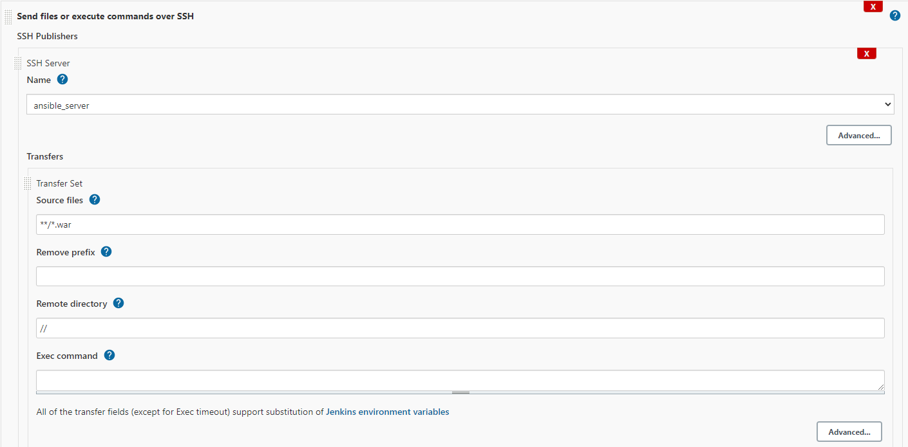
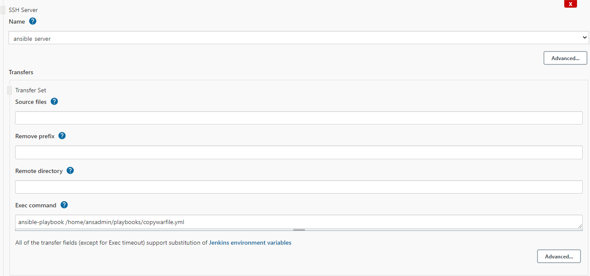

# Setup Simple DevOps Project - 02

## Java Web Application ( WAR ) file Deployment.

### Jenkins fetch Java Code from GitHub and Build a WAR file, Built Artifact is copied to Ansible Server then Ansible Server copies the Artifact to Tomcat Server webapp folder.


## Pre-requistes:

* #### EC2 instance with Tomcat Serer [Installation steps here](../Tomcat/install-tomcat-ec2.md)
* #### Jenkins Server [Installation steps here](../Jenkins/install-jenkins-docker-compose.md)
* #### Ansible Tower Server [Installation steps here](../Ansible/install-ansible-tower-single-machine-integrated.md)

## Configure SSH User in Ansible Server

```sh
useradd ansadmin
passwd *******

visudo

#Add this user
ansadmin ALL=(ALL) ALL

vi /etc/ssh/sshd_config
# Change PasswordAuthentication no To PasswordAuthentication yes

#Restart SSH Service
```

Copy Tomcat Server IP to Ansible Host files

```
echo "<Tomcat server IP>" >> /etc/ansible/hosts
```

## Configure SSH User in Tomcat Server

```sh
useradd ansadmin
passwd *******

visudo

#Add this user
ansadmin ALL=(ALL) NOPASSWD:ALL

vi /etc/ssh/sshd_config
# Change PasswordAuthentication no To PasswordAuthentication yes

#Restart SSH Service
service sshd restart
```
Login as a **ansadmin** user on master (Ansible Server) and generate ssh key (Master)

```
ssh-keygen
```

Copy keys onto all ansible client (Tomcat Server) nodes (Master)

```
ssh-copy-id ansadmin@<Tomcat Server IP>
```

## Jenkins Integration Steps

Install "publish Over SSH"

- `Manage Jenkins` > `Manage Plugins` > `Available` > `Publish over SSH`

Enable connection between Ansible and Jenkins

-   `Manage Jenkins` > `Configure System` > `Publish Over SSH` > `SSH Servers`

    - SSH Servers:
        - Name: `ansible_server`
        - Hostname: `<Ansible ServerIP>`
        - username: `ansadmin`
        - password: `*******`
    - Test the connection "Test Connection"


## Create Playbook for Copy WAR From Ansible Server to Tomcat Server

create a copywarfile.yml on Ansible under **/home/ansadmin/playbooks**

```
vi copywarfile.yml
```
Copy the below code save and exit 

```
- name: Ansible Copy WAR File Local to Remote
  hosts: all
  tasks:
    - name: copying file with playbook
      become: true
      copy:
        src: ~/target/sample-web.war
        dest: /opt/apache-tomcat-9.0.55/webapps
```      
## Jenkins Integration Steps

Install "publish Over SSH"

- `Manage Jenkins` > `Manage Plugins` > `Available` > `Publish over SSH`

Enable connection between Ansible and Jenkins

-   `Manage Jenkins` > `Configure System` > `Publish Over SSH` > `SSH Servers`

    - SSH Servers:
        - Hostname: `<Ansible ServerIP>`
        - username: `ansadmin`
        - password: `*******`
    - Test the connection "Test Connection"


## Create Jenkins job

- Source Code Management:

    - Repository : `https://github.com/raguyazhin/sample-web.git`
    - Branches to build : `*/master`

- Build:

    - Root POM : `pom.xml`
    - Goals and options : `clean install package`

- Add post-build steps

    - Send files or execute commands over SSH
        - SSH Server : `ansible_server`
        - Source fiels : `**/*.war`
        - Remote directory : `//`



- Add post-build steps

    - Send files or execute commands over ssH
        - SSH Server : `ansible_server`
        - Exec command : `ansible-playbook /home/ansadmin/playbooks/copywarfile.yml`



**Save and Build Now**