# Setup Simple DevOps Project - 05

## Java Web Application ( WAR ) file Deployment.

### AWS Code Pipeline fetch Java Code from GitHub through AWS Code build, Build a WAR file and deploy to AWS Elastic Beanstalk Tomcat

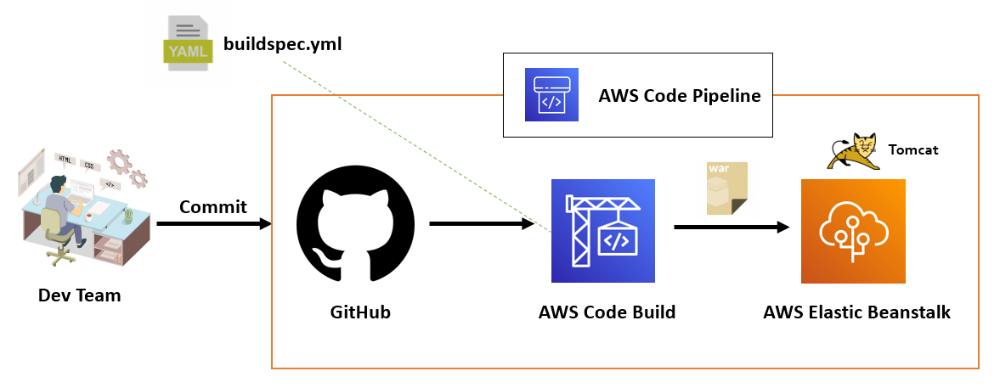

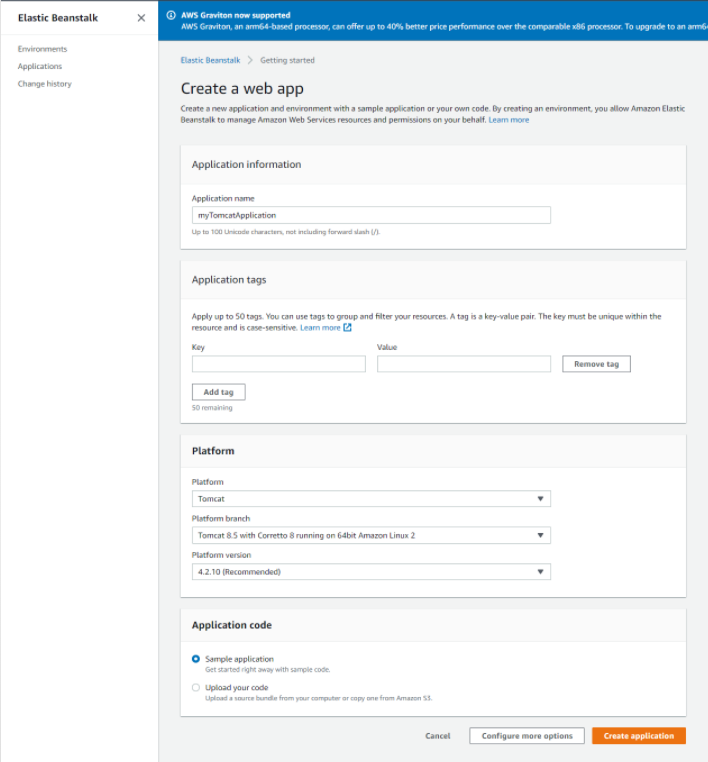

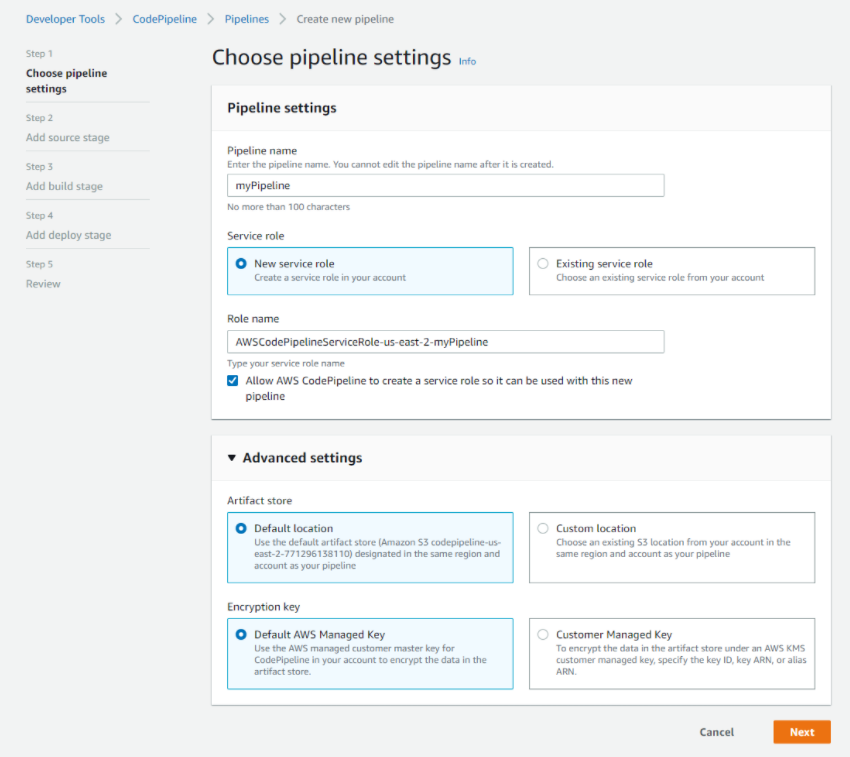

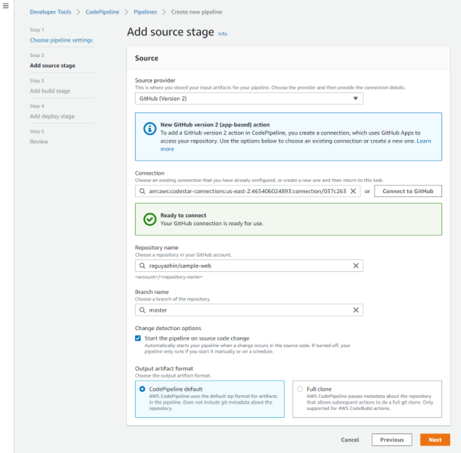

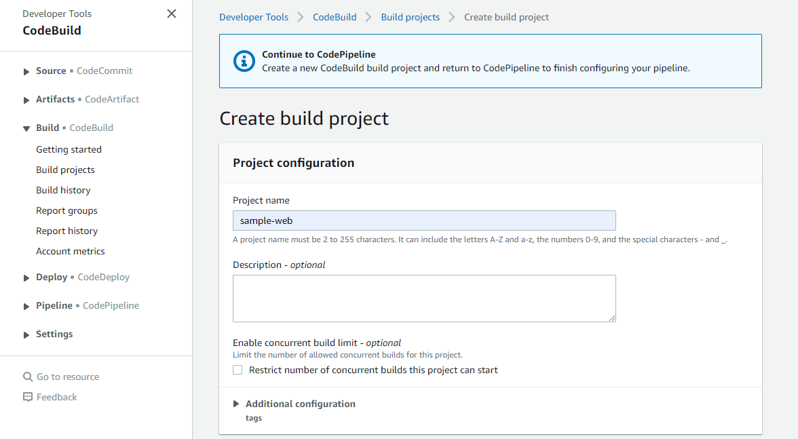

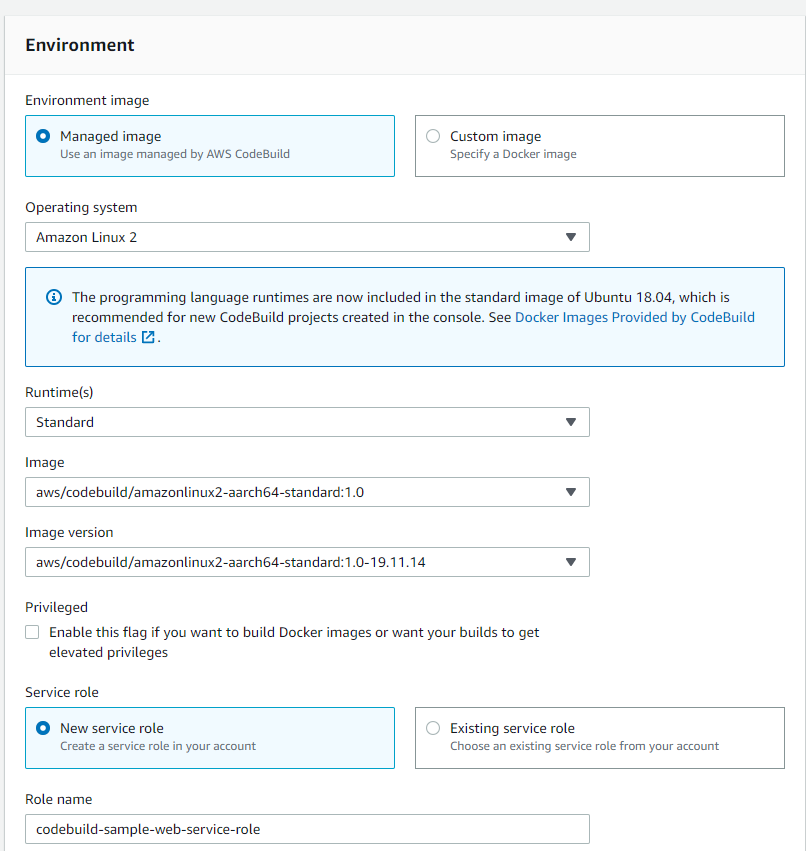

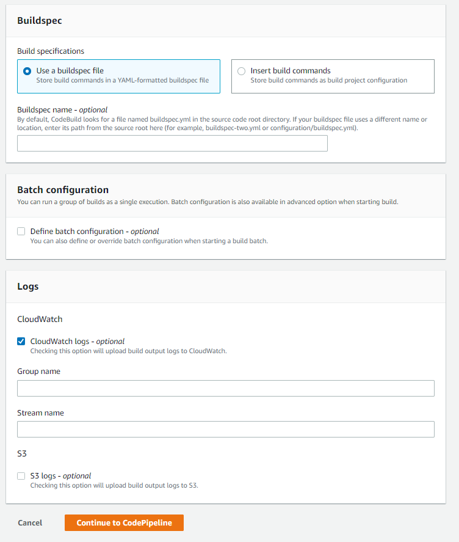

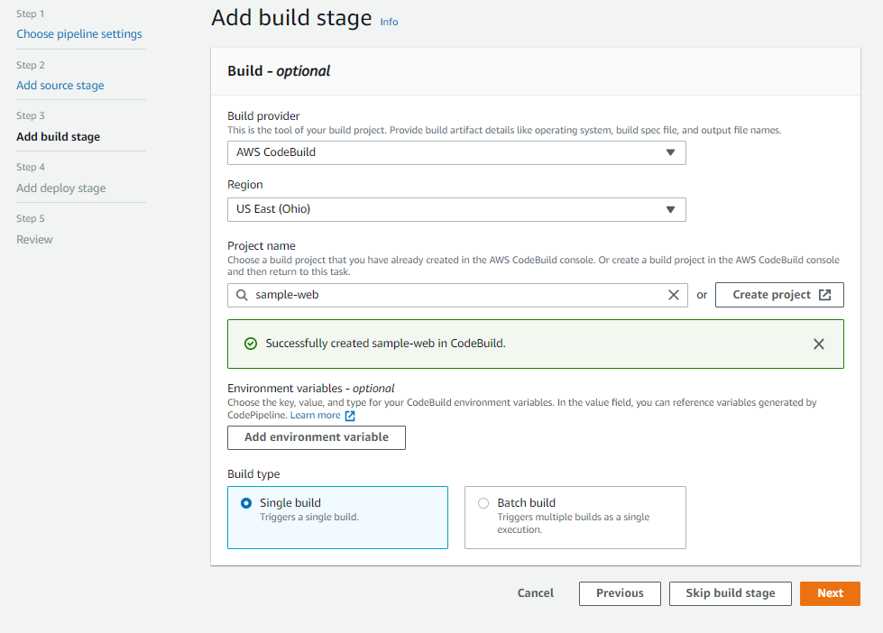

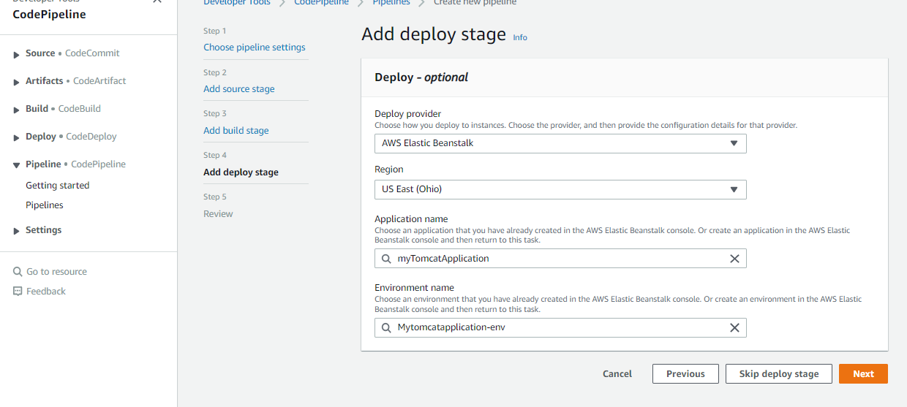

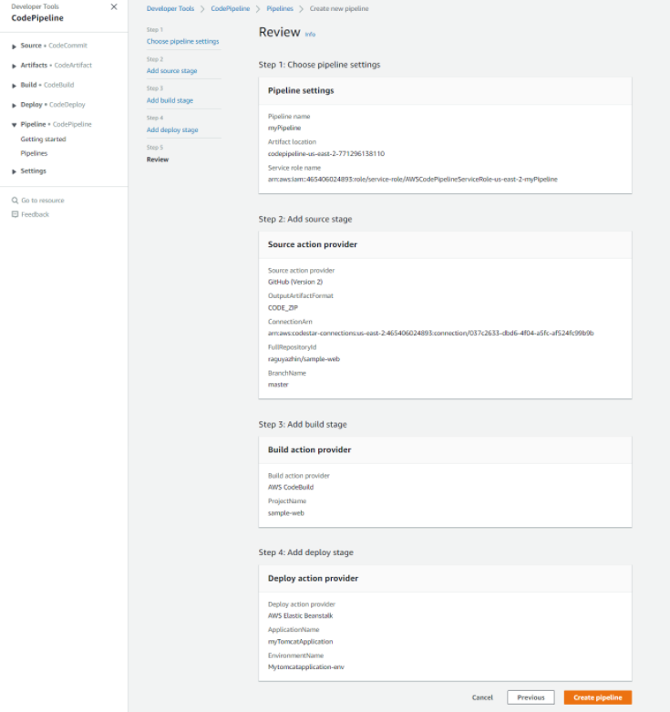

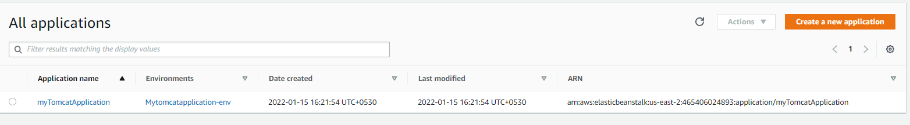

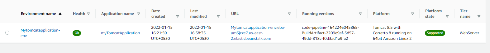

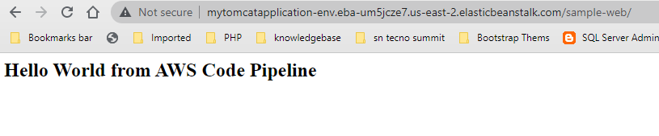