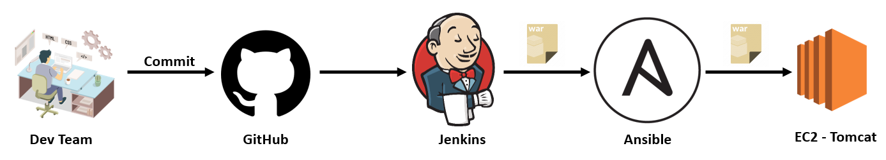

# Setup Simple DevOps Projects - 02

## Java Web Application ( WAR ) File Deployment.
 

### Jenkins Fetch Java Code from GitHub, Build a WAR file, Builded Artifact copied to Ansible Server and the Ansible Server copy the Artifact to Tomcat Server webapp folder.

## Pre-requistes:

* ### EC2 instance with Tomcat Serer [Installation steps here](../Tomcat/install-tomcat-ec2.md)
* ### Jenkins Server [Installation steps here](../Jenkins/install-jenkins-docker-compose.md)
* ### Ansible Server [Installation steps here](../Ansible/install-ansible-tower-single-machine-integrated.md)